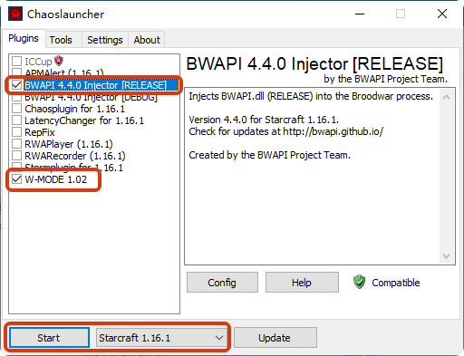
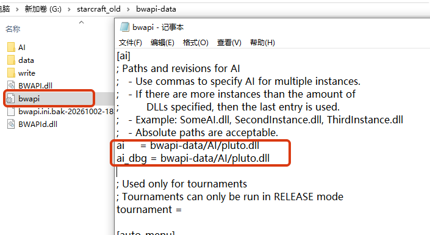
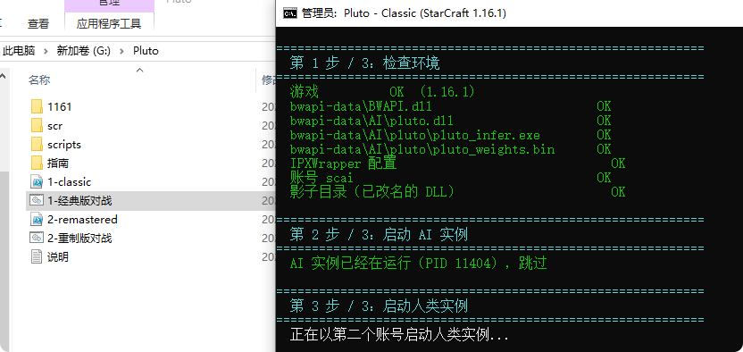
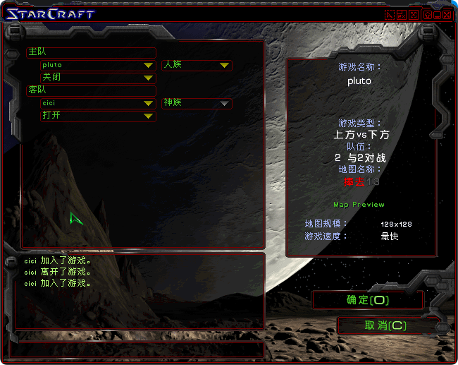
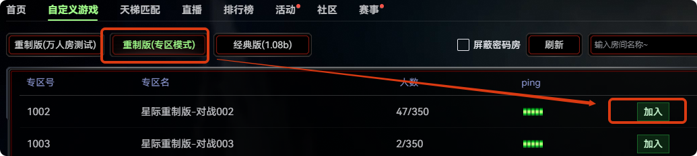
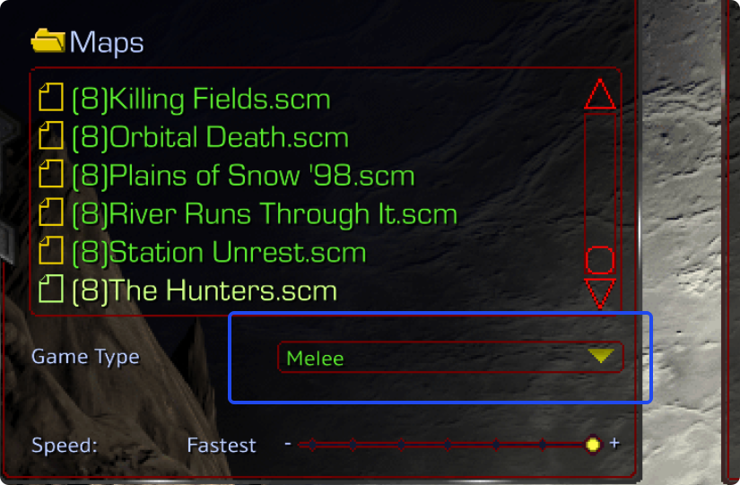
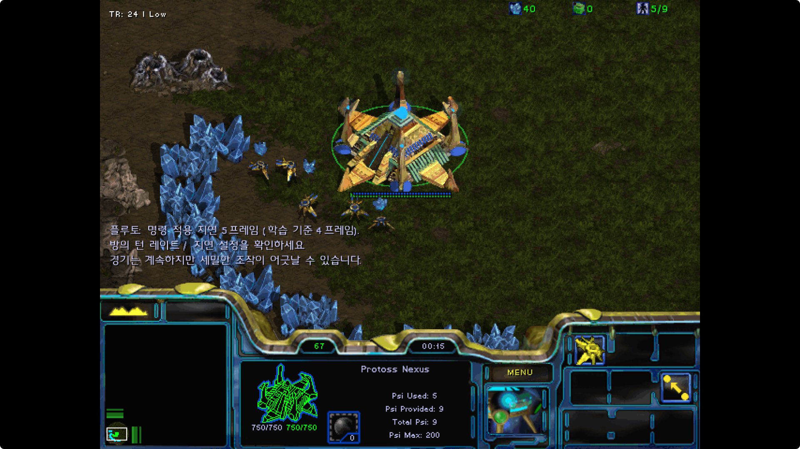

# Pluto 国内部署指南

在**星际争霸**里和 Pluto（一个纯强化学习训练出来的 AI）对战 —— 国内环境的完整整合过程与使用方法。

本仓库**只提供脚本和文档，不包含任何游戏本体、也不包含任何第三方二进制**。所有组件都在安装时从上游官方来源获取，并用 SHA256 校验版本。

> **访问地址**
> · Gitee（国内，访问快）：https://gitee.com/cici8382/pluto-cn
> · GitHub（国际）：https://github.com/cici8382/pluto-cn
> 两边内容完全一致，国内读者建议用 Gitee。

---

## ⚠️ 使用边界（请先读这一段）

这套东西是**用来学习和体验 AI 的**，请在下面这个范围内使用：

- ✅ **可以**：自定义房间、约战、人机对战、直播演示、录制素材、教学分享
- ✅ **可以**：和愿意和 AI 交手的对手打
- ❌ **不要**：进公开排位 / 天梯匹配去和不知情的路人打

理由有两层，都很实际：

1. **对别人不公平。** 这套工具公开之后，天梯被机器人灌、真人被收割是有先例的（亚服那波就是这么来的）。陪练和炸鱼是两件事。
2. **对你自己有风险。** 对战平台（KK、11对战、浩方等）封号通常是连账号带直播号一起处理。自定义房间没人举报，排位匹配一定有人举报。

房间名请写成 `Pluto AI 1v1` 之类，让进来的人知道在和一个 AI 打。

---


> 🎬 **视频演示**：[点这里看 B 站](https://www.bilibili.com/video/BV1SopF6CENB/)
>
> 视频演示的是 **AI 有多强**（对局实录），也提到了需要哪些依赖，但 **没有演示安装过程** ——
> 想自己装，按下面的「从哪开始看」走；安装教程以后另做。

## 先看效果

**经典版** —— Chaoslauncher 挂上 BWAPI，Pluto 接管之后：

| 挂载 BWAPI 与窗口化 | 指定 Pluto 路径 | 一键脚本跑起来 |
|---|---|---|
|  |  |  |

**同机 IPX 联机成功** —— 两个实例互相看得见（这是最难的一步）：



**重制版** —— KK 平台里和 AI 对战：

| 专区模式进房间 | 建房必须选 Melee | AI 接管（聊天框有韩语提示） |
|---|---|---|
|  |  |  |

> 最后一张图聊天框里那行韩语是 Pluto 的实时状态提示（"命令应用延迟 5 帧…"）——
> 看到它就说明 AI 已经接管了战场。

---

## 两条线怎么选

| | **1.16.1（经典版）** | **重制版（Remastered）** |
|---|---|---|
| 稳定性 | ✅ 成熟，脚本充足 | ⚠️ 实验性，上游项目已下架 |
| 画质 | 1998 年原味 | 现代画质（需账号授权） |
| 版本要求 | 1.16.1 任意安装 | **锁死 `1.23.10.13515` x86**，暴雪热更即失效 |
| 同机对战 | ✅ 可行（IPX 方案） | ❌ 需要两台机器或平台房间 |
| 和真人联机 | ✅ 局域网 / IPX | ✅ 局域网 / KK 平台 |
| 适合 | 想稳定长期用、做教学 | 想要好画质、做内容演示 |

**建议**：想稳定出内容就先走 **1.16.1**；重制版那条线当成"尝鲜/演示"，因为它随时可能因为一次热更而失效。

---

## 前置条件

**必须自己准备的（本仓库不提供）：**

- **星际争霸：母巢之战 1.16.1** —— 走 1.16.1 那条线需要
- **星际争霸：重制版** —— 走重制版那条线需要；且版本必须是 `1.23.10.13515`
- Windows 10/11 64 位
- 建议 6 核以上、2GB 空闲内存
- **CPU 必须支持 AVX2** —— 没有它根本跑不起来（不是慢，是起不来）
- 建议 6 核以上、2 GB 空闲内存

**脚本会自动获取的（从上游官方来源）：**

| 组件 | 用途 | 许可证 |
|---|---|---|
| [Pluto](https://github.com/tscmoo/pluto) | AI 本体 | 未声明 |
| [BWAPI 4.4.0](https://github.com/bwapi/bwapi) | 1.16.1 的 AI 接口 | LGPL-3.0 |
| [Chaoslauncher](https://www.teamliquid.net/forum/brood-war/484495-chaoslauncher) | 1.16.1 的注入器 | 未声明 |
| [IPXWrapper](https://github.com/solemnwarning/ipxwrapper) | 1.16.1 同机/局域网联机 | GPL-2.0 |
| Pluto 重制版桥接 | 把 Pluto 接到重制版 | 未声明，且**原仓库已下架** |

详见 [THIRD-PARTY.md](THIRD-PARTY.md)。

---

## 快速开始

### 走 1.16.1

```powershell
# 1. 检测环境（确认游戏版本、运行时、CPU 指令集）
.\scripts\1161\01-check-env.ps1

# 2. 按提示获取 Pluto / BWAPI / Chaoslauncher，然后校验
.\scripts\1161\02-verify.ps1 -Pluto <你的 pluto.dll 路径>

# 3. 部署同机联机（让 AI 实例和你的实例各用一个 IPX 节点）
.\scripts\1161\03-setup-same-pc.ps1
```

详细步骤见 **[docs/02-1.16.1-安装与同机联机.md](docs/02-1.16.1-安装与同机联机.md)**

### 走重制版

```powershell
# 1. 检测环境（确认是不是 13515 x86）
.\scripts\scr\01-check-env.ps1

# 2. 按提示获取 Pluto 和桥接，然后校验
.\scripts\scr\02-verify.ps1 -Pluto <pluto.dll 路径> -Bridge <桥接目录>

# 3. 开 KK 平台（带联机环境变量），进房间让平台拉起游戏
# 4. 注入 AI
.\scripts\scr\03-inject-kk.ps1
```

连续直播建议挂自动注入：

```powershell
.\scripts\scr\03-inject-kk.ps1 -Watch
```

详细步骤见 **[docs/03-重制版-安装与KK平台联机.md](docs/03-重制版-安装与KK平台联机.md)**

---

## 给 AI 助手用

这个仓库是**为 AI 编码助手准备过的** —— 你可以直接把链接丢给自己的 AI，让它读着部署。

| 文件 | 给谁 |
|---|---|
| **[AGENTS.md](AGENTS.md)** | **AI 助手读这个**：任务、硬约束、逐步验证、哪里必须停下来问你 |
| **[manifest.json](manifest.json)** | 机器可读清单：组件、下载地址、SHA256、目标路径、禁止事项 |
| [llms.txt](llms.txt) | LLM 抓取索引 |
| 其余文档 | 给人读的详细说明 |

**怎么用**：把仓库链接发给你的 AI 助手，说"按 AGENTS.md 帮我装"。它会自己检测环境、校验版本、按步骤走，遇到需要你决定的地方（选哪条路线、游戏从哪来）会停下来问你。

> 说明：AI 助手不会替你搞游戏本体，也不会跟你要账号密码 —— AGENTS.md 里写死了这些红线。

---

## 从哪开始看

| 你是 | 看这个顺序 |
|---|---|
| **完全新人**，想先搞清楚值不值得搞 | [07-常见问题](docs/07-常见问题.md) → [01-原理与版本选择](docs/01-原理与版本选择.md) |
| **已经决定要装**，选了经典版 | [02-1.16.1-安装与同机联机](docs/02-1.16.1-安装与同机联机.md) |
| **已经决定要装**，选了重制版 | [03-重制版-安装与KK平台联机](docs/03-重制版-安装与KK平台联机.md) |
| **装完跑不顺** | [05-排错手册](docs/05-排错手册.md) |
| **技术人**，想看这东西是怎么被啃下来的 | [06-探索过程记录](docs/06-探索过程记录.md) |

---

## 文档导航

| 文档 | 内容 |
|---|---|| 文档 | 内容 |
|---|---|
| **[AGENTS.md](AGENTS.md)** | 🤖 **给 AI 助手**：可执行的部署说明 |
| **[manifest.json](manifest.json)** | 🤖 机器可读：组件 / 哈希 / 路径 |
| **[07-常见问题](docs/07-常见问题.md)** | ⭐ **新人先看这篇**，能省掉大半来回 |
| [01-原理与版本选择](docs/01-原理与版本选择.md) | Pluto 是什么、BWAPI 与重制版桥接的关系、AI 是否遵守战争迷雾 |
| [02-1.16.1-安装与同机联机](docs/02-1.16.1-安装与同机联机.md) | 经典版部署 + **同机双开联机的两个坑**（IPX 节点重复、IPXWrapper 互斥体） |
| [03-重制版-安装与KK平台联机](docs/03-重制版-安装与KK平台联机.md) | **国内整合流程**：x86 客户端、KK 配置、按 PID 注入、只认 Melee |
| [04-性能调优](docs/04-性能调优.md) | CPU 指令集（AVX-VNNI）的影响、线程数、STRADDLE 与帧预算 |
| [05-排错手册](docs/05-排错手册.md) | 日志怎么读、每条错误对应什么、崩溃怎么判断 |
| [06-探索过程记录](docs/06-探索过程记录.md)| [06-探索过程记录](docs/06-探索过程记录.md) *(进阶/花絮)* | 完整排查实录：怎么从"连不上"一步步定位到根因 |
| [07-常见问题（FAQ）](docs/07-常见问题.md) | **先看这篇**：花多少钱、电脑够不够、会不会封号、AI 不动怎么办 |

---

## 关于"能不能打包成安装包"

不能，而且不建议。原因：

- 游戏本体是暴雪版权，**任何形式的打包分发都是侵权**
- Pluto 和重制版桥接**都没有声明许可证**（默认等于保留所有权利），不能随包分发
- 重制版桥接的**原仓库已经下架**，上游随时可能彻底消失

所以本仓库的形态是：**脚本负责"获取 + 校验 + 配置"，文档负责"讲清楚为什么"。** 组件从上游拿，版本靠 SHA256 锁死。这个形态不会过期、不会被下架，也是唯一能长期存在下去的形态。

---

## 致谢

- **Pluto** —— [tscmoo](https://github.com/tscmoo)，纯自对弈强化学习训练出来的星际 AI
- **重制版桥接** —— `chan22222`（原仓库已下架，镜像见 [THIRD-PARTY.md](THIRD-PARTY.md)）
- **逆向文档** —— [hwkim3330/pluto-re](https://github.com/hwkim3330/pluto-re)，本仓库关于"AI 是否遵守战争迷雾"的结论来自这里
- **IPXWrapper** —— [Daniel Collins](https://github.com/solemnwarning)
- **BWAPI** —— [bwapi](https://github.com/bwapi/bwapi)

---

## 免责声明

本项目为个人学习与技术分享，与暴雪娱乐、上述任何作者均无关联。

使用本仓库内容产生的一切后果由使用者自行承担，包括但不限于账号封禁、数据丢失、系统异常。请在遵守当地法律和平台服务条款的前提下使用。

**再次强调：不要用于公开排位匹配。**
